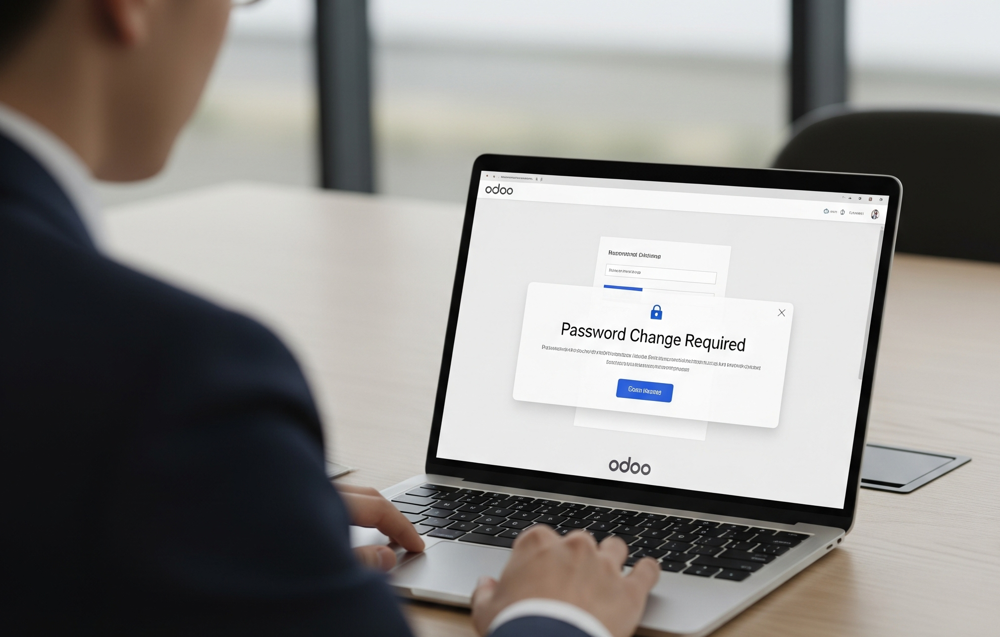

# DL Force Password Change on First Login 🔐



## 📌 Overview
O módulo **DL Force Password Change on First Login** garante maior segurança ao forçar os utilizadores a alterarem a sua palavra-passe no **primeiro login** ou sempre que o administrador definir essa opção.  
É uma solução leve e prática, voltada para reforçar a segurança nas empresas que usam o **Odoo 17**.

---

## ✨ Funcionalidades
- 🔑 Obriga os utilizadores a alterar a password no primeiro login.  
- 👨‍💻 Funciona tanto para novos utilizadores como para utilizadores existentes.  
- ⚙️ Configuração simples: basta marcar a opção *Force Password Change on Next Login*.  
- 🖥️ Interface amigável para redefinir a password.  
- 🔒 Melhora a segurança do sistema Odoo.  

---

## 📸 Screenshots
### Tela de Configuração


### Tela de Login com Solicitação de Mudança de Senha


### Tela do Wizard de Alteração de Senha


---

## 🚀 Como funciona
1. Acesse **Configurações > Utilizadores**.  
2. Crie um novo utilizador ou edite um existente.  
3. Ative a opção **Force Password Change on Next Login**.  
4. No próximo login, o utilizador será **obrigado a alterar a senha** antes de acessar o sistema.  

---

## 🛠️ Instalação
1. Clone o repositório:
   ```bash
   git clone git@github.com:dl-digitalub-AO/dl_login_force_password_change.git
